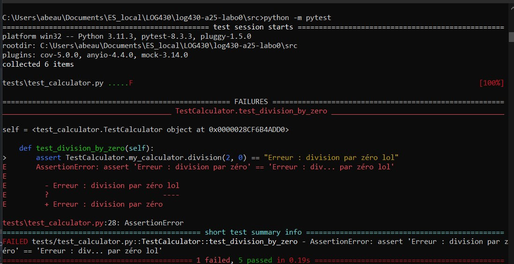
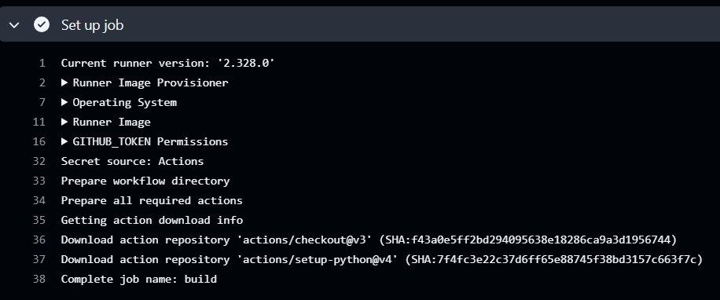
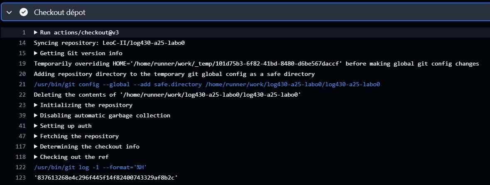

# Labo 00 – Infrastructure (Git, Docker, CI/CD)
    
ÉTS - LOG430 - Architecture logicielle - Chargé de laboratoire: Gabriel C. Ullmann, Automne 2025.  

Travail réalisé par Alex Beauchamp

## Question 1: Échec d'un test
Lors de l'échec d'un test, les détails de l'erreur sont affichés, incluant la différence entre la réponse attendue
et la réponse ici.


## Question 2: Étapes du CI
La première étape est celle du "setup" qui sert à mettre en place l'environnement
du runtime qui sera utilisée pour rouler le reste des étapes



La deuxième étape est celle du "checkout" qui sert à copier le commit qui vient
d'être commit et de l'importer dans l'environnement qui vient d'être
créé.



## Question 3: Étapes du CD (annulée)
J'ai créé un script [redeploy.sh](../webhook/redeploy.sh) qui permet
de fetch les dernier changements de github, d'arrêter les containers
liés au labo0, de rebuild une nouvelle image et de la déployer dans le container.

Due à certains problèmes avec la VM, je ne sais pas encore laquelle
sera la meilleure mais je considère deux options:
1. Ajouter une étape dans le job qui contient un sshpass vers la VM
   (utilisant les secrets de github) qui ensuite roulerait simplement
ce script.
2. Ajouter un wehbook qui s'active lorsque le job est done qui ferait une requête
POST vers la VM. Pour recevoir cette requête, le package [webhook](https://github.com/adnanh/webhook)
a été installé, le fichier [hooks.json](../webhook/hooks.json) a été créé et
le webhook a été lancé avec la commande suivante:
```
webhook -hooks /home/log430/log430-a25-labo0/webhook/hooks.json -verbose
```

## Question 4: Information par "top" (annulée)
En ce moment je n'arrive ni à POST à ma VM pour une raison qui m'échappe,
et comme le GitLab n'est pas encore mis en place, il est impossible pour moi
d'utiliser la solution 1 de la Q3 non plus. Je ne peux donc pas avoir accès
à ces informations